Fastlane
===

# 

##### App automation done right

###### Julien Goudet - iOS Lead Developer @ Cityway (:bird: [@jlngdt](https://github.com/jlngdt) )

---

# Summary

* What is Fastlane ? :rocket:
* Main usage :desktop_computer:
* Gitlab integration :fox_face:
* Coding session :pager:


---
<!-- page_number: true -->
<!-- footer: Fastlane: presentation & integration - Julien Goudet -->

# Fastlane

- Felix Krause (:bird: [@fkrause](https://github.com/fkrause) )
	
- Joined Fabric (Twitter) in Oct. 2015
- Joined Google in Jan. 2017 
- :gem:


```json
"The easiest way to build and release mobile apps. 
Fastlane handles tedious tasks so you don’t have to."
```
---

# `$ fastlane beta`

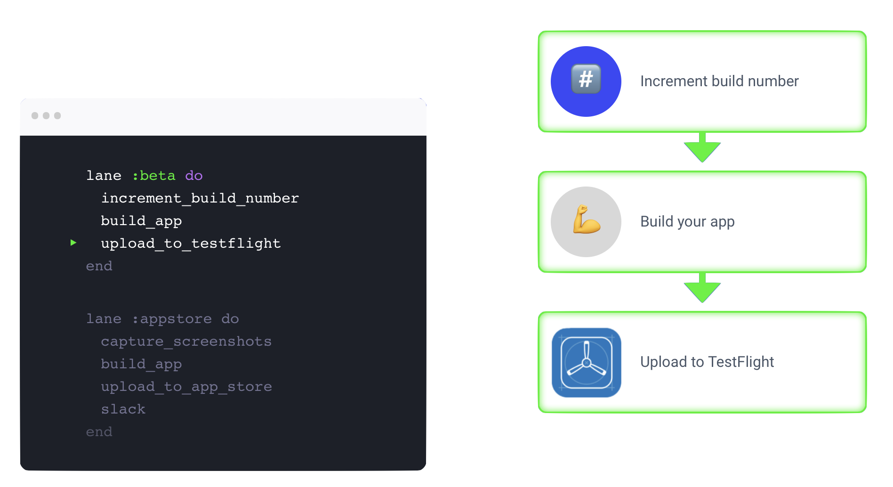


---

# `$ fastlane appstore`

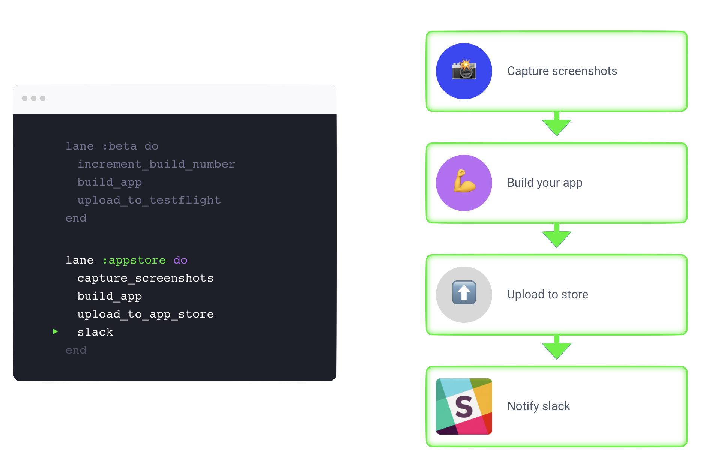


---


# How to Basic - Installation 

Install fastlane using

```
[sudo] gem install fastlane -NV
```

*or alternatively using* 
```json
brew cask install fastlane
```

---

# How to Basic - Initialization 

Navigate to your project directory and run

```
fastlane init
```

**Bonus for Swift lover :**
```json
fastlane init swift
```
for a full Swift setup ([Beta feature](https://docs.fastlane.tools/getting-started/ios/fastlane-swift/))

---

# How to Basic - Initialization 

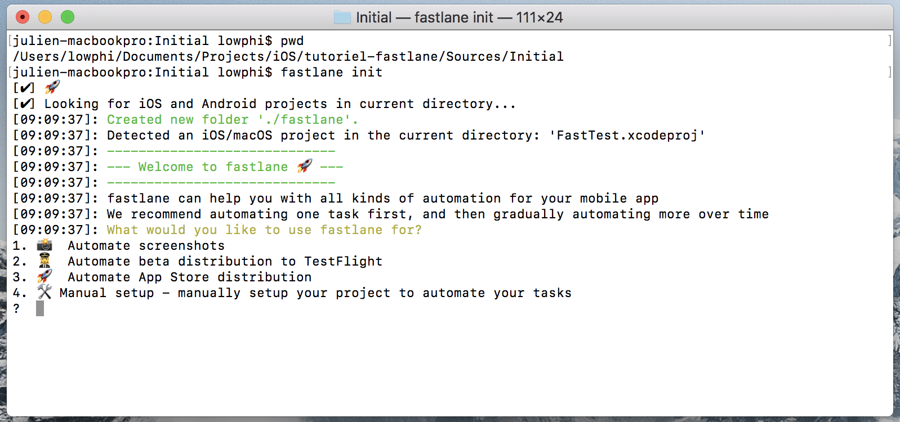

---

# How to Basic - Initialization 

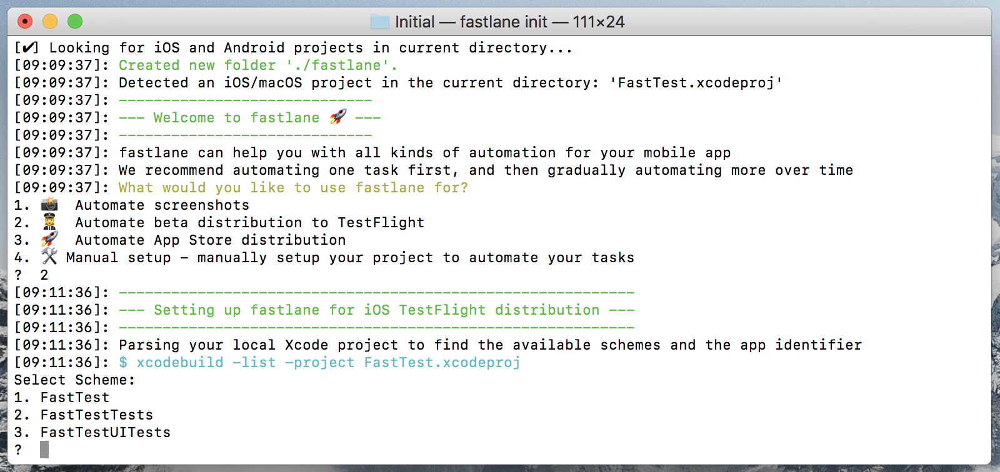

---

# How to Basic - Initialization

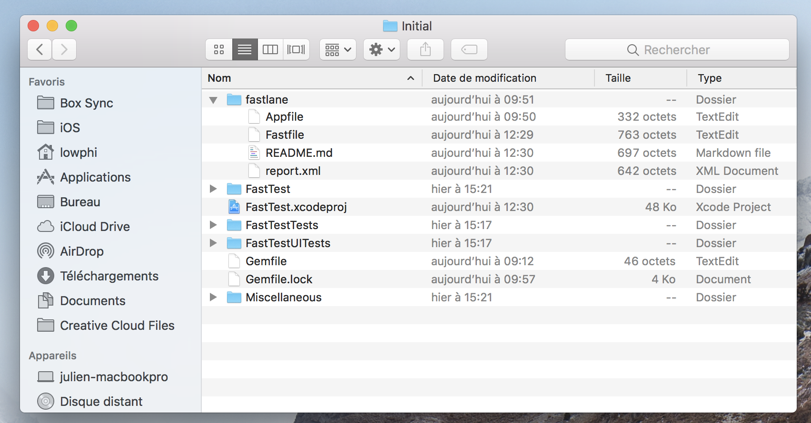

---

# How to Basic - Initialization

* `AppFile`: Autogenerated by Fastlane (env variables)
* `Fastfile`: step-by-step ruby/swift script
	* What we are going to improve

* `Gemfile`: manage a Ruby application's gems

---

# How to Basic - Usage

```
fastlane lanes
```

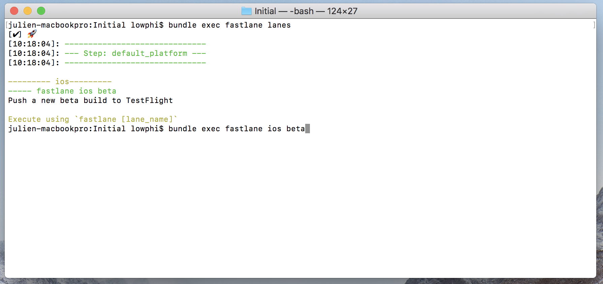

---

# How to Basic - Usage
```json
fastlane ios beta
```
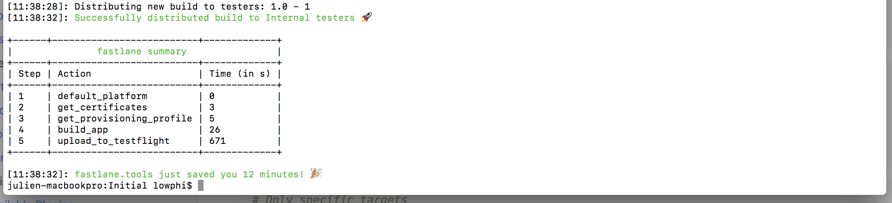
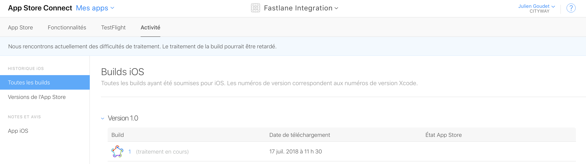

---

# "Et voilà !!"


---

# Fastfile for iOS

```
default_platform(:ios)

platform :ios do
  desc "Push a new beta build to TestFlight"
  lane :beta do
    build_app(scheme: "FastTest")
    upload_to_testflight
  end
end

```

* `fastlane ios beta` and `fastlane beta` do the same
* `upload_to_testflight` uses `Appfile` 

---

# Fastfile for Android

```
default_platform(:android)

platform :android do
desc "Push a new beta build to Play Store"
  lane :beta do
    gradle(task: 'assemble', build_type: 'Release')
    upload_to_play_store(track: 'beta')
    slack(message: 'Great Success !')
  end
end

```

* `fastlane android beta` and `fastlane beta` do the same
* `upload_to_play_store` uses `Appfile` 

---

# Main actions

## Building

* `gym`	Alias for the build_ios_app action
* `cocoapods`	Runs pod install for the project
* `gradle`	All gradle related actions, including building and testing your Android app
* `carthage`	Runs carthage for your project

---


# Main actions

## Testing

* `swiftlint`	Run swift code validation using SwiftLint
* `xcov`	Nice code coverage reports without hassle
* `sonar`	Invokes sonar-scanner to programmatically run SonarQube analysis

---


# Main actions

## Documentation

* `jazzy`	Generate docs using Jazzy
* `appledoc`	Generate Apple-like source code documentation from the source code

---

# Main actions

## Beta 

* `pilot`	Alias for the upload_to_testflight action
* `crashlytics`	Upload a new build to Crashlytics Beta
* `hockey`	Upload a new build to HockeyApp
* `testflight`	Alias for the upload_to_testflight action

---

# Gitlab Integration :fox_face:

---

# Gitlab - Hook system

* `.gitlab-ci.yml` file ("Yet Another Markup Language")

```
variables:
  LC_ALL: "en_US.UTF-8"
  LANG: "en_US.UTF-8"

fastlane:
  script:
    - bundle exec fastlane beta tag:${CI_COMMIT_TAG} update_pod:true
  tags:
    - ios
    - xcode
  only:
    - /^hockey\/.*$/
```

* Each git commits with `hockey/*` format message will trigger the script
* Tags for CI runner (send the job on a macos machine for ex)

---

# Gitlab - Pipelines

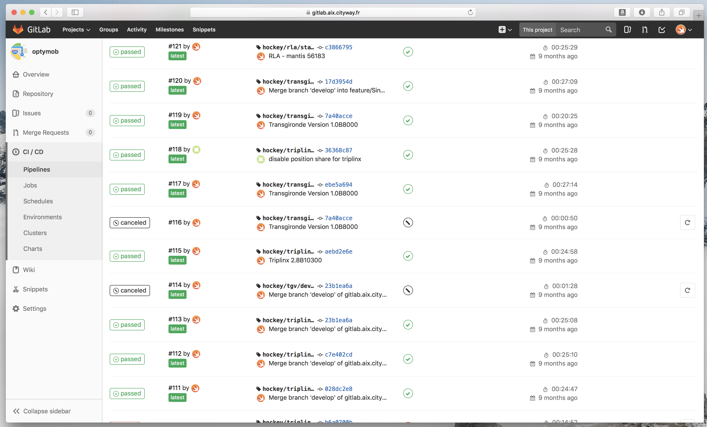

---

# Gitlab - Pipelines

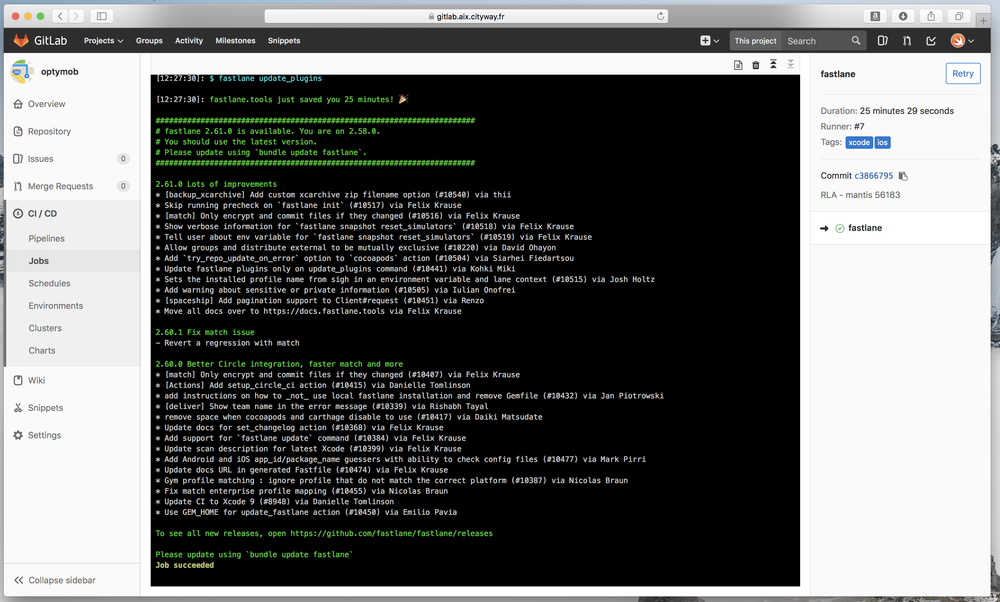


---

# Ideal Workflow (iOS or Android)

* The dev...
	* Commit changes on git and tag manually this one :white_check_mark:
	* `or`
	* Commit changes with already good version/build number :white_check_mark:
* gitlab ci 
	* hook it, build, archive, upload & git-tag :white_check_mark: (with `changelog.md content` :construction:)
	* notify with url and infos
		* silently if success :white_check_mark:
		* **@here** if failed  :white_check_mark:
	* send preformatted email to a distribution-list with url and infos :construction:

---


# The reality... for iOS :robot:

---

# Some things to hook manually

* Apple Dev Portal connection (2 step f*cking authentication)
* Firewall issues
* Code Signing (automatic vs manual vs external)

---

# The joy of Apple 2FA

* Need to create an app specific password to your account
* appleid.apple.com
* Keep it private
* `FASTLANE_APPLE_APPLICATION_SPECIFIC_PASSWORD` env

---

# The joy of Firewall

* Dark magic for fastlane (even in [official documentation](https://docs.fastlane.tools/actions/upload_to_app_store/#firewall-issues))
* `DELIVER_ITMSTRANSPORTER_ADDITIONAL_UPLOAD_PARAMETERS` env
	* must be set to `-t DAV` 

---

# The joy of Code Signing 

* Automatic .... but not for upload
* multiple solutions provided by Fastlane  [official documentation](https://docs.fastlane.tools/codesigning/getting-started/)
* "Disable auto / build / Enable auto" method
	* more info on Fastlane  [official documentation](https://docs.fastlane.tools/actions/automatic_code_signing/)

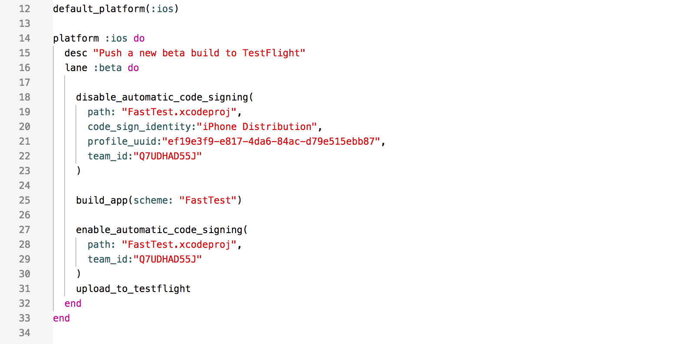

---

## Enjoy! :sunglasses:

<br>

### https://github.com/juliengdt/tutoriel-fastlane

MIT License - 2018 [Julien Goudet](https://github.com/juliengdt)
Fastlane is released under the [MIT License](https://github.com/fastlane/fastlane/blob/master/LICENSE).